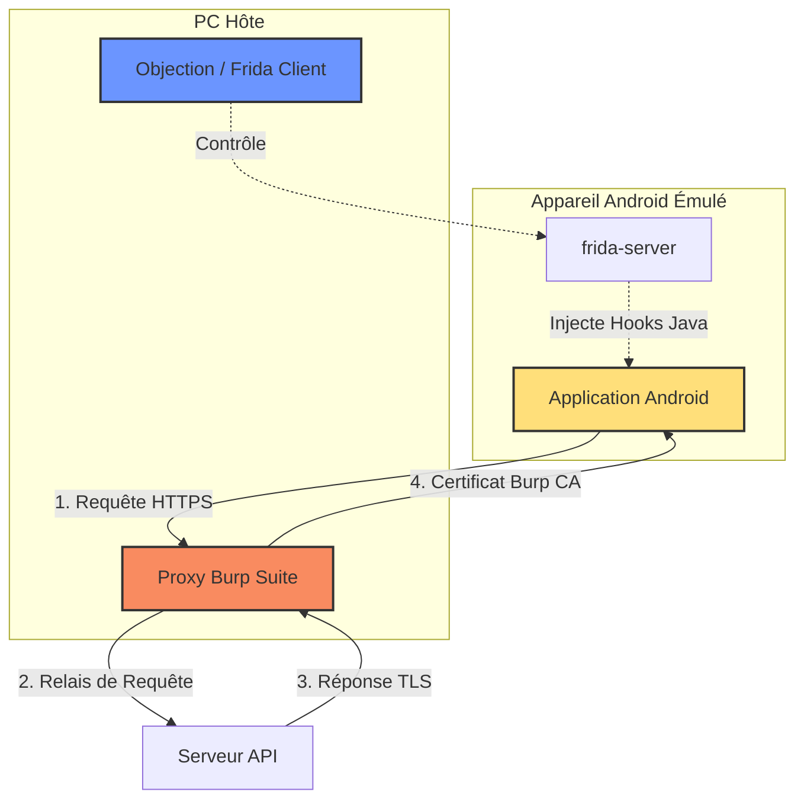
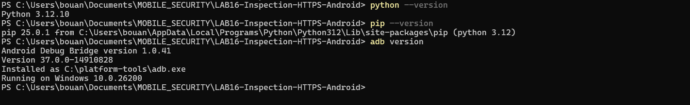
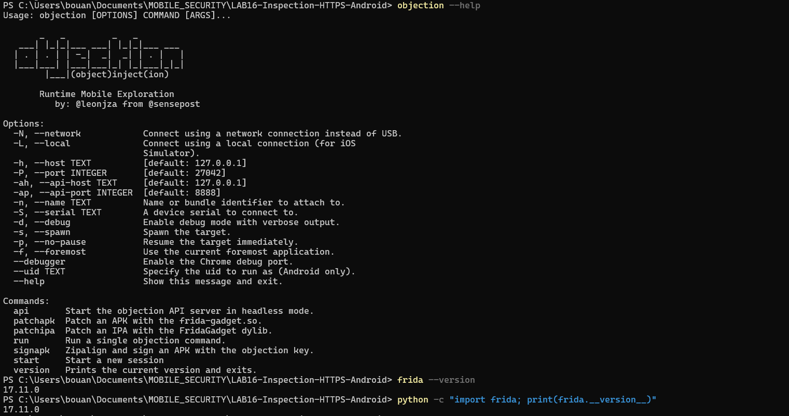
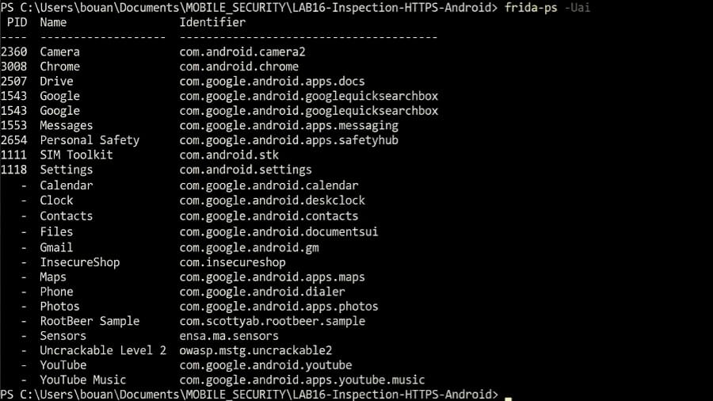
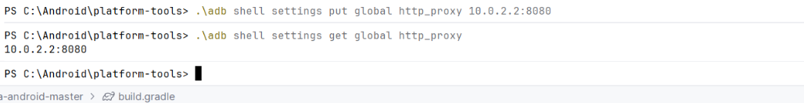
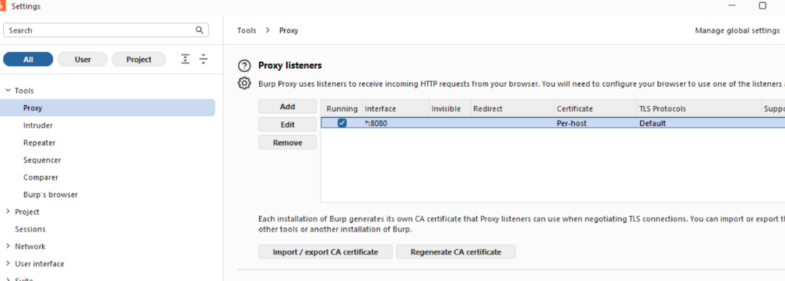
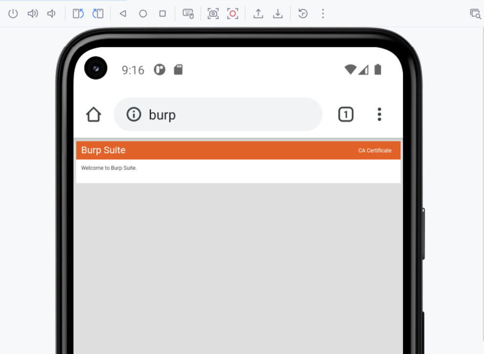
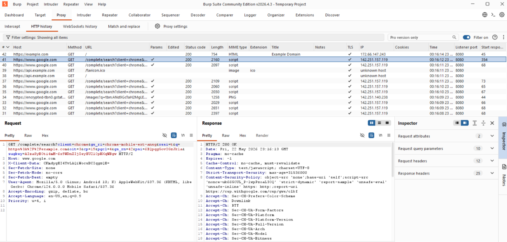
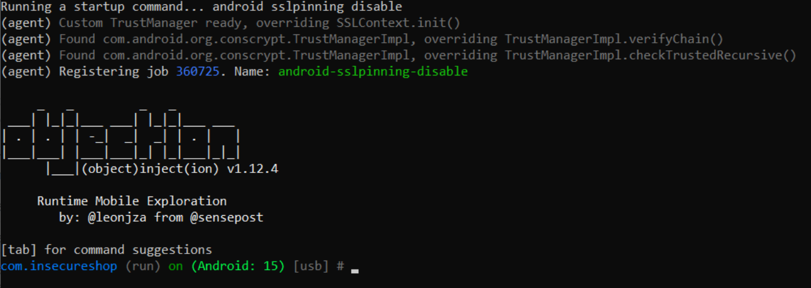
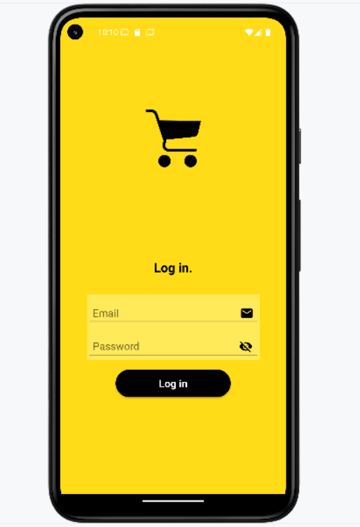

# Inspection HTTPS Android : Contournement du SSL Pinning avec Objection & Burp Suite

[]()
[]()
[]()
[]()

Ce dépôt contient le rapport d'exécution pas-à-pas et la documentation pour le **LAB 16 : Inspection HTTPS Android : Désactivation du SSL Pinning avec Objection + Proxy (Burp/mitmproxy)**. 

L'objectif de ce laboratoire est de configurer un environnement d'analyse dynamique afin de contourner le mécanisme de verrouillage SSL (*SSL Pinning*) d'une application Android standard (`InsecureShop`), dans le but d'inspecter son trafic HTTPS en clair via un outil d'interception (Burp Suite).

---

## Table des Matières

1. [Architecture & Fonctionnement](#-architecture--fonctionnement)
2. [Prérequis & Environnement de Test](#-prérequis--environnement-de-test)
3. [Étape 1 : Vérifications de l'environnement](#étape-1--vérifications-de-lenvironnement)
4. [Étape 2 : Préparation de l'appareil & frida-server](#étape-2--préparation-de-lappareil--frida-server)
5. [Étape 3 : Configuration du Proxy & Installation de la CA](#étape-3--configuration-du-proxy--installation-de-la-ca)
6. [Étape 4 : Contournement du SSL Pinning avec Objection](#étape-4--contournement-du-ssl-pinning-avec-objection)
7. [Étape 5 : Validation & Capture du Trafic](#étape-5--validation--capture-du-trafic)
8. [Script Utilitaire de Proxy](#%EF%B8%8F-script-utilitaire-de-proxy)
9. [❓ Dépannage & FAQ](#-dépannage--faq)
10. [⚠️ Avertissement Légal](#%EF%B8%8F-avertissement-légal)

---

## Architecture & Fonctionnement

L'inspection de trafic chiffré sur Android nécessite la mise en place d'une attaque *Man-in-the-Middle* (MitM) contrôlée :



* **Le Proxy (Burp Suite)** écoute sur le port `8080` de toutes les interfaces réseau. Il génère dynamiquement des certificats SSL pour chaque site visité.
* **Le Certificat CA de Burp** est installé sur le téléphone pour que le système d'exploitation accepte les certificats générés par Burp.
* **Objection (surcouche Frida)** intervient car les applications modernes implémentent le *SSL Pinning*, refusant même les certificats de l'autorité de certification utilisateur. Objection injecte dynamiquement des hooks Java au démarrage de l'application afin de modifier le comportement des bibliothèques HTTP courantes (OkHttp, ConsCrypt, TrustManagers) pour forcer l'acceptation de tout certificat présenté, y compris celui du proxy.

---

## Prérequis & Environnement de Test

Le lab a été exécuté sur un poste de travail Windows avec les spécifications techniques suivantes :
* **Système d'exploitation :** Windows 10.0.26200
* **Python :** version 3.12.10
* **Pip :** version 25.0.1
* **ADB (Android Debug Bridge) :** version 1.0.41 (Platform Tools version 37.0.0, installé dans `C:\platform-tools\adb.exe`)
* **Frida :** version 17.11.0 (côtés PC et appareil Android émulé)
* **Objection :** version 1.12.4
* **Application Cible :** InsecureShop (`com.insecureshop`)
* **Plateforme Cible :** Émulateur Android (AVD) sous Android 15 (API 35)

---

## Étape 1 : Vérifications de l'environnement

Avant de commencer, nous validons la présence et les versions des outils fondamentaux sur l'hôte Windows :

```powershell
# Vérification des versions de base
python --version
pip --version
adb version
```



Nous vérifions ensuite la version d'Objection et de Frida afin de s'assurer de leur alignement :

```powershell
objection --help
frida --version
python -c "import frida; print(frida.__version__)"
```



> [!IMPORTANT]
> Il est impératif que la version du client Frida installé sur votre machine hôte corresponde **exactement** à la version de `frida-server` exécutée sur l'appareil Android cible (ici `17.11.0`).

---

## Étape 2 : Préparation de l'appareil & frida-server

1. Activez le débogage USB sur l'émulateur/appareil Android.
2. Identifiez l'architecture CPU de l'appareil pour télécharger le bon binaire de `frida-server` :
   ```powershell
   adb shell getprop ro.product.cpu.abi
   ```
3. Poussez `frida-server` sur le téléphone, accordez les permissions d'exécution, et démarrez-le en tâche de fond :
   ```powershell
   adb push frida-server /data/local/tmp/
   adb shell chmod 755 /data/local/tmp/frida-server
   adb shell "/data/local/tmp/frida-server -l 0.0.0.0"
   ```
4. Listez les applications installées sur l'appareil pour obtenir l'identifiant exact de l'application cible :
   ```powershell
   frida-ps -Uai
   ```



Comme le montre l'image ci-dessus, l'application cible **InsecureShop** a pour identifiant de package unique `com.insecureshop`.

---

## Étape 3 : Configuration du Proxy & Installation de la CA

### 1. Configuration réseau
Pour intercepter le trafic HTTP/HTTPS, nous devons rediriger le trafic réseau du téléphone vers le proxy Burp Suite configuré sur l'hôte. 
* Sous Android Emulator, l'adresse spéciale IP `10.0.2.2` fait référence à la boucle locale de l'hôte (`127.0.0.1` du PC de développement). 
* Nous configurons le proxy global de l'appareil via la commande `adb shell settings` :

```powershell
# Définir le proxy sur l'adresse IP virtuelle de l'hôte et le port 8080
adb shell settings put global http_proxy 10.0.2.2:8080

# Vérifier la bonne prise en compte du proxy
adb shell settings get global http_proxy
```



### 2. Configuration de Burp Suite
Sur le PC hôte, Burp Suite doit être configuré pour écouter sur toutes les interfaces afin de recevoir les connexions provenant de la passerelle de l'émulateur :

* Allez dans **Proxy** -> **Proxy settings** -> **Proxy listeners**.
* Éditez le port par défaut pour écouter sur `*:8080` (All interfaces).



### 3. Installation du certificat CA de Burp
Comme HTTPS est chiffré, le proxy doit intercepter les connexions en se faisant passer pour les serveurs réels. Pour cela, il signe les connexions à la volée avec son propre certificat racine (CA). Nous devons faire confiance à cette CA sur l'appareil.

* Ouvrez Google Chrome sur l'appareil Android et naviguez vers `http://burp`.
* Cliquez sur **CA Certificate** en haut à droite pour télécharger le certificat sous le nom `cacert.der`.



* Renommez l'extension du certificat en `.cer` (ou installez-le directement via les paramètres système d'Android : **Settings** -> **Security & privacy** -> **More security settings** -> **Encryption & credentials** -> **Install a certificate** -> **CA Certificate**).

### 4. Validation préliminaire de l'interception
Afin de vérifier que le proxy réseau est opérationnel, nous visitons des sites web HTTPS classiques depuis le navigateur Google Chrome de l'appareil. Le trafic doit apparaître en clair dans l'onglet **HTTP history** de Burp Suite :



---

## Étape 4 : Contournement du SSL Pinning avec Objection

Certaines applications (dont `InsecureShop`) rejettent explicitement les certificats racine utilisateur ou implémentent du SSL Pinning strict, ce qui empêche d'intercepter leur trafic même après l'installation de la CA de Burp. Pour contourner cette protection, nous utilisons **Objection** au démarrage (*spawn*) de l'application.

Nous démarrons l'application à l'aide de la commande suivante, qui injecte directement la commande de désactivation du pinning dès le chargement en mémoire :

```powershell
objection -g com.insecureshop explore --startup-command "android sslpinning disable"
```



**Analyse de la console Objection :**
* `Custom TrustManager ready, overriding SSLContext.init()` : Objection remplace la logique d'initialisation du contexte SSL global.
* `Found com.android.org.conscrypt.TrustManagerImpl` : Objection repère les vérificateurs système natifs d'Android et applique des hooks sur les méthodes critiques `verifyChain()` et `checkTrustedRecursive()`.
* L'agent applique le correctif et retourne avec succès une invite de commande interactive sur le package de l'application.

---

## Étape 5 : Validation & Capture du Trafic

Une fois le SSL pinning neutralisé par Objection, l'application s'ouvre normalement et n'affiche plus d'erreurs de connexion SSL/TLS. 



Nous pouvons désormais saisir des identifiants de test dans le formulaire de connexion de l'application et capturer toutes les requêtes d'API HTTPS (comme les requêtes de login, l'envoi de jetons, les détails du panier, etc.) directement et en clair dans notre proxy Burp Suite.

---

## Script Utilitaire de Proxy

Pour simplifier les tâches répétitives liées à l'application et au nettoyage de la configuration du proxy système sur l'émulateur, ce dépôt contient le script utilitaire [`manage_proxy.ps1`](file:///c:/Users/bouan/Documents/MOBILE_SECURITY/LAB16-Inspection-HTTPS-Android/manage_proxy.ps1).

### Utilisation

Ouvrez une invite PowerShell et lancez le script selon votre besoin :

* **Vérifier le proxy actuel :**
  ```powershell
  .\manage_proxy.ps1 -Action Get
  ```
* **Configurer le proxy de l'émulateur (vers Burp Suite hôte) :**
  ```powershell
  .\manage_proxy.ps1 -Action Set -Proxy "10.0.2.2:8080"
  ```
* **Désactiver et réinitialiser le proxy de l'appareil :**
  ```powershell
  .\manage_proxy.ps1 -Action Clear
  ```

---

## ❓ Dépannage & FAQ

#### ❌ L'application crash immédiatement lors du lancement avec le paramètre `spawn`
* **Cause :** Certaines applications détectent le débogage ou l'injection précoce au démarrage et provoquent un crash volontaire pour se protéger.
* **Résolution (Méthode Attach) :** Lancez l'application normalement sur le téléphone. Une fois sur la page d'accueil, attachez Objection à la session en cours :
  ```powershell
  objection -g com.insecureshop explore
  ```
  Puis, une fois dans la console Objection, exécutez manuellement la commande :
  ```text
  android sslpinning disable
  ```

#### ❌ Burp Suite n'affiche aucun trafic provenant de l'appareil Android
* **Vérification réseau :** Assurez-vous que l'hôte Windows et l'appareil de test sont connectés au même sous-réseau WiFi (si vous utilisez un appareil physique) et que le proxy est configuré sur l'adresse IP locale correcte de l'hôte (ex: `192.168.X.Y`). Si vous utilisez l'émulateur, l'IP doit être `10.0.2.2`.
* **Pare-feu Windows :** Assurez-vous que le pare-feu de Windows autorise Burp Suite à accepter des connexions entrantes sur le port `8080`.

#### ❌ Objection indique un succès de désactivation, mais l'app refuse toujours de se connecter
* **SSL Pinning natif / Obfuscation :** L'application utilise peut-être du pinning au niveau natif (C/C++ via BoringSSL/OpenSSL) ou un framework hybride (comme Flutter ou React Native) qui n'utilise pas le TrustManager standard de Java. 
* **Résolution :** Il est nécessaire d'utiliser un script Frida spécialisé dans le contournement natif ou Flutter (disponible sur des dépôts de scripts Frida externes tels que Frida Codeshare) au lieu des commandes génériques d'Objection.

---

## ⚠️ Avertissement Légal

Ce guide et les scripts fournis sont réservés exclusivement à un usage éducatif et de recherche en sécurité dans un cadre d'audit légal. L'exécution de ces techniques sur des applications sans l'accord explicite de leurs propriétaires est interdite. Les auteurs déclinent toute responsabilité en cas de mauvaise utilisation de ces outils.
